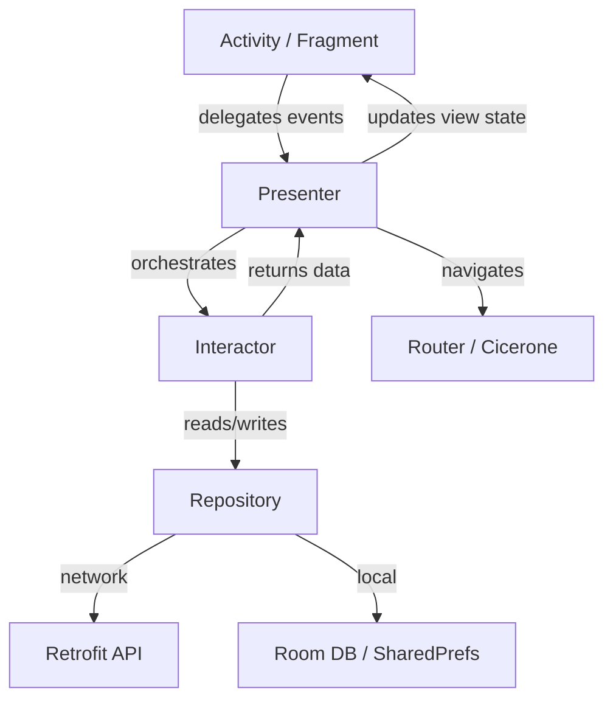

<div align="center">
  
  <h1>Re-Shikimori App</h1>
  <p><strong>Alternative Android client for <a href="https://shikimori.one">Shikimori</a> — the ultimate anime & manga community platform</strong></p>

  <!-- Badges -->
  <p>
    
    
    
    
    
    
    
    
    
  </p>

  <p>
    <a href="https://trello.com/b/TeSnqIHY/shimori">📋 Trello Board</a>
    ·
    <a href="https://4pda.to/forum/index.php?showtopic=903970">💬 4PDA Forum</a>
    ·
    <a href="https://github.com/gnoemes/Shikimori-App-Remastered/releases">📦 Downloads</a>
  </p>
</div>

---

## 🌟 Features

| Category | Details |
|----------|---------|
| **📺 Anime Catalog** | Browse, search, and filter anime — sort by title, score, status, genre, season, type, and more |
| **📚 Manga & Ranobe** | Full manga and light novel catalog with advanced filters and search |
| **📅 Calendar** | Weekly anime airing schedule — never miss an episode |
| **⭐ User Ratings** | Rate anime/manga with flexible scoring, manage your personal list |
| **🎯 Recommendations** | Personalized recommendations based on your taste |
| **🎬 Video Player** | Built-in ExoPlayer with episode streaming, gesture controls, and video quality selection |
| **👤 User Profiles** | View profiles, stats, activity feed, friends, and favorite titles |
| **💬 Comments & Topics** | Read and post comments, participate in forum discussions |
| **🔐 OAuth 2.0 Auth** | Secure login via Shikimori OAuth |
| **🔔 Notifications** | Push notifications via Firebase Cloud Messaging |
| **🌙 Dark Theme** | Full Material Design dark theme support |
| **📱 Tablet Optimized** | Adaptive layout for phones and tablets |
| **⚡ Offline Cache** | Room database for offline access to recently viewed data |
| **🎭 Roles & Staff** | Character details, voice actors (seiyuu) and production staff information |
| **🔗 Deep Linking** | Deep link support for sharing content between users |

---

## 📸 Screenshots

<!-- Screenshots -->

_Screenshots coming soon. Contributions welcome!_

---

## 🛠 Tech Stack

| Category | Library | Purpose |
|----------|---------|---------|
| **Language** | Kotlin 2.3.21 | Primary language with Java interop for Dagger modules |
| **Architecture** | MVP (Moxy 2.2.2) | Model-View-Presenter pattern with `@InjectViewState` |
| **Dependency Injection** | Dagger 2.59.2 (Android) | Compile-time DI with `@Module`, `@Binds`, `@ContributesAndroidInjector` |
| **Navigation** | Cicerone 5.1.1 | Type-safe router-based navigation with local NavigatorHolder |
| **Async** | RxJava 2.2.21 | Reactive streams (`Single`, `Completable`, `Observable`) |
| **Networking** | Retrofit 2.11.0 + OkHttp 4.12.0 | REST client with Gson converter and RxJava2 adapter |
| **Serialization** | Gson 2.11.0 | JSON parsing |
| **Local Database** | Room 2.7.1 + RxJava2 | SQLite ORM with reactive queries (migrated from StorIO) |
| **Image Loading** | Glide 4.16.0 + OkHttp | Efficient image caching and loading |
| **Video Player** | ExoPlayer 2.19.1 | Video playback with media session extension |
| **UI Components** | Material Design, ConstraintLayout, ViewPager2, Flexbox, Shimmer, CircleImageView | Modern adaptive UI |
| **Firebase** | BOM 33.5.1 | Analytics, Crashlytics, Messaging, Firestore, Storage |
| **HTML/BBCode** | Jsoup 1.17.2, KefirBB 1.5 | Content parsing and rendering |
| **Date/Time** | Joda-Time Android 2.12.7 | Timezone-safe date handling |
| **Charts** | SimpleRatingBar 1.5.1 | Interactive rating UI |
| **Animations** | Android-SpinKit 1.4.0, Shimmer 0.5.0 | Loading animations and placeholders |
| **Build** | AGP 9.1.1, KSP 2.3.9, Gradle 8.10.2 | Modern build pipeline |
| **Minification** | ProGuard + R8 | Code shrinking and obfuscation for release builds |

---

## 🏗 Architecture

The app follows a **clean MVP architecture** with clear separation of concerns:



### Layers

| Layer | Components | Responsibility |
|-------|------------|---------------|
| **View** | Activities, Fragments (Moxy views) | Render UI, delegate user actions to Presenter |
| **Presenter** | `MvpPresenter` subclasses | Business logic orchestration, RxJava subscription management |
| **Domain** | Interactors | Pure business logic, no Android dependencies |
| **Data** | Repositories, API services, DAOs | Data source abstraction (network vs. local) |
| **DI** | Dagger modules (Java) | Dependency graph wiring, scoped components |

Presenter lifecycle managed by Moxy: `onFirstViewAttach()` → `initData()` ensures data loads on first render. Presenters are scoped with `@ActivityScope` and injected via `AndroidInjection.inject(this)`.

---

## 🔧 Build from Source

### Prerequisites

- **Java 17+** (JDK 17)
- **Android SDK 35** (compileSdk 35, targetSdk 35)
- **Android Studio** (latest stable, or CLI)
- **Gradle** (wrapper included — no manual install needed)

### Setup

```bash
# Clone the repository
git clone https://github.com/gnoemes/Shikimori-App-Remastered.git
cd Shikimori-App-Remastered

# Configure API keys (see gradle.properties.example)
# Edit gradle.properties with your Shikimori OAuth credentials:
#   ShikimoriClientId=your_client_id
#   ShikimoriClientSecret=your_client_secret
#   ShikimoriBaseUrl=https://shikimori.one
#   VideoBaseUrl=...
#   VkRandomToken=...
```

### Build Commands

```bash
# Debug build (unsigned, with debug symbols)
./gradlew assembleDebug

# Release build (minified, shrunk, zipaligned)
./gradlew assembleRelease
```

Debug APK gets `.debug` suffix and `-SNAPSHOT` version name. Release build applies ProGuard rules from `proguard-rules.pro`.

### Open in Android Studio

1. File → Open → select project directory
2. Wait for Gradle sync to complete
3. Run ▶ on `app` configuration

> **Note:** `google-services.json` is committed and required for Firebase features.  
> **Note:** The app uses `multiDexEnabled true` — no manual multidex setup needed.

---

## 📲 Download

Pre-built APKs are available on the [**Releases page**](https://github.com/gnoemes/Shikimori-App-Remastered/releases).

- `app-debug.apk` — Debug build with `-SNAPSHOT` version suffix
- `app-release.apk` — Optimized release build (recommended for daily use)

---

## 🤝 Contributing

Contributions are welcome! Here's how to help:

1. **Fork** the repository
2. Create a **feature branch** (`git checkout -b feature/amazing-feature`)
3. **Commit** your changes (`git commit -m 'Add amazing feature'`)
4. **Push** to the branch (`git push origin feature/amazing-feature`)
5. Open a **Pull Request**

### Guidelines

- Follow existing code style (4-space indent, Kotlin/Javadoc comments)
- Keep the MVP pattern — presenters handle logic, views stay dumb
- Test edge cases (even though no test framework is currently set up)
- No external service keys in code — use `gradle.properties`

---

## 📄 License

This project is licensed under the **MIT License** — see the [LICENSE](LICENSE) file for details.

```
MIT License

Copyright (c) 2024 gnoemes

Permission is hereby granted, free of charge, to any person obtaining a copy
of this software and associated documentation files (the "Software"), to deal
in the Software without restriction, including without limitation the rights
to use, copy, modify, merge, publish, distribute, sublicense, and/or sell
copies of the Software, and to permit persons to whom the Software is
furnished to do so, subject to the following conditions...
```

---

## 🔗 Links

- [🌐 Shikimori Website](https://shikimori.one)
- [📋 Trello Board](https://trello.com/b/TeSnqIHY/shimori) — development roadmap
- [💬 4PDA Forum Thread](https://4pda.to/forum/index.php?showtopic=903970) — community discussion
- [🐛 Issues](https://github.com/gnoemes/Shikimori-App-Remastered/issues) — report bugs or request features
- [📦 Releases](https://github.com/gnoemes/Shikimori-App-Remastered/releases) — download APKs

---

<div align="center">
  <sub>Built with ❤️ for the Shikimori community</sub>
</div>
